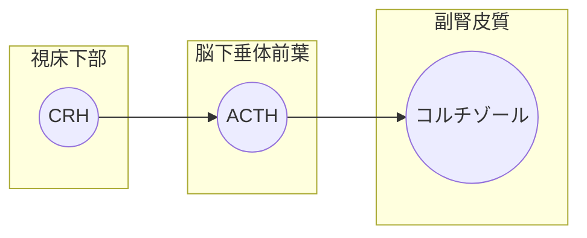

クロミフェンというのは排卵誘発薬なのだが、抹消でエストロゲン受容体をブロックすることでGnRHとLH/FSHの放出をん刺激する。視床下部にも働きかける。

ストレスホルモンについて、代表格はコルチゾールで作用は血糖値の上昇や血圧の上昇。これに類似したホルモンは上昇する。GHやカテコラミン、レニン、バソプレシンなどがあげられる。ちなみにPRLも上昇する。GHと共通の祖先を持つらしい。先端巨大症でPRLが上昇することもある。

逆に、ストレスをうけると性機能は低下する。なんとなくイメージできる。GnRH、FSH、LH、エストロゲンなど性ホルモンは全て低下される。

ACTHの上位ホルモンはCRH。

sheehan症候群は汎下垂体機能低下症。

先端巨大症では骨・軟部組織が増大するのだが、それによって末梢神経が障害されることがある。そのため手根管症候群は症状非一つとして重要である。虚血性心疾患は合併しやすい。これは耐糖能異常や脂質異常症をきたしやすいことが背景にある。

先端巨大症限定...GHがTRHやGnRHに反応する。

甲状腺機能低下症が高PRL血症につながることがある。

Chiari Frommel症候群、産褥期の高PRL血症が授乳中止語も持続する疾患。もちろん乳汁分泌や無月経がある。

ドパミン受容体を遮断する薬は高PRL血症になる。

Sheehan症候群ではKはあまり影響を受けない。副腎に影響がでるからNa同様Kもと考えがちだが、実はミネラルコルチコイドの分泌は保たれておる、Kは不変。これはAddison病との違い。ちなみに副腎機能低下症では好酸球の著明な増加が見られる。

副腎皮質機能低下症は原発性か続発性かで臨床像が結構異なる。

リンパ球性下垂体炎、注意が必要。ラトケ嚢胞が細菌多いらしい。実はIgG4関連疾患。下垂体腺腫との鑑別が重要になってくる

中枢性尿崩症では下垂体後葉のT1強調像での高信号が消失する。

高カルシウム血症は腎性尿崩症の原因となる。

輸液のうち、5%ブドウ糖液は純粋な水分補給、生理食塩水は電解質の補充の意味合いがある。生理食塩水は入れたところ、つまり血管に留まりやすく、四分の一が血漿に追加される。

尿濃縮能が低下している所見として、尿比重と尿浸透圧を見ることが重要。

サイアザイドは腎性尿崩症の治療薬となりうる。これいつまでたってもメカニズムがわからない。

SIADHではNaの低値がとにかく特徴的、体液量は意外と変化しない。

甲状腺摘出後にはテタニーのリスクがある。これは近くの副甲状腺を摘出してしまうこといよる。

TRAb...TSH受容体抗体、バセドウ病似特徴的な自己抗体。抗甲状腺ペルオキシダーゼ抗体は無痛性甲状腺炎でも陽性となるのでTRAbのほうがよい。

甲状腺機能亢進症の薬としてはチアマゾールとプロピルチオウラシルを覚えておこう。

TSHとhCGは親戚で、妊娠を契機に甲状腺機能亢進症を発症することがある。
$$
α作用=血管収縮\\
β作用=血管拡張
$$

## β遮断薬

甲状腺機能亢進症においては*頻脈や振戦*といった症状が見られる。こうした症状は**交感神経が活発**になって生じるので、**β遮断薬**が有効である。もちろん根本的な治療法ではなく対症療法である。しかし、かなり速効性があり、症状もきちんと改善するのでよく用いられる。β遮断薬として**プロプラノロール**を覚えておこう。

## 抗甲状腺薬の副作用

抗甲状腺薬の副作用として最も重要なのが**無顆粒球症**である。血液から*好中球が消失する*。当然、重篤な感染症を引き起こすことになり、生命予後に直結する。無顆粒球症が疑われたらすぐに**薬剤を中止する**。その後、G-CSFを投与して好中球を戻す。

## 亜急性甲状腺炎の治療

亜急性甲状腺炎も**甲状腺機能亢進症**であるが、バセドウ病とは一味違う。この疾患では**ウィルス感染**により甲状腺が破壊されることで、甲状腺ホルモンが溢れ出している。実際に甲状腺の働きが亢進しているわけではないので、抗甲状腺薬や無機ヨードは当然無効。まずは**ウィルス感染による炎症**を抑えにいかなくてはならない。**NSAIDs**や**副腎皮質ステロイド**が望ましい。ちなみにウィルス感染なので*抗菌薬は無効*。甲状腺の細菌感染には**急性化膿性甲状腺炎**という別の病名がつく。

## 抗甲状腺薬を使うときに注意すべきこと

甲状腺機能亢進症には*２つの病態*がある。一つは本当に甲状腺の機能が更新しているケース。バセドウ病などが当てはまる。もう一つは、甲状腺の組織破壊によって甲状腺ホルモンが溢れ出してきているケース。この場合、見かけ上は甲状腺機能が亢進しているが、実際の甲状腺の働きは正常もしくは低下している。

**抗甲状腺薬**というのは甲状腺の実際の働きを抑制するお薬なので、後者に対しては**相対禁忌**になる。後者に対して投与してしまった場合、甲状腺機能低下症を引き起こし、取り返しがつかなくなる可能性もあるからだ。抗体検査をしてTRAb陽性を確認してから出ないと、抗甲状腺薬を投与してはいけない。

同様に、*無機ヨード*や*甲状腺亜全摘*といった治療も抗体検査の結果を待ってから行わなくてはならない。

## 甲状腺機能低下症の症状

まずは、**バセドウ病の逆**を考える。頻脈→徐脈、振戦→活動性の低下、下痢→便秘。これだけでもかなりの症状が割り出せる。追加で覚えなくてはならないのが**コレステロール高値**と**CK上昇**だ。それから下痢の反対で、*体内に水分が貯留する*。**浮腫**も大事な症状である。**非圧痕性浮腫**で有ることに注意しよう。圧痕は残さない。

最後に**認知機能の低下**は重要なので覚えておこう。活動性の低下と結びつけるとよいかもしれない。頭の活動性が低下しているのだ。

## 補足：非圧痕性浮腫について

圧痕を残すかどうかというのはなにできまるのだろうか？それは浮腫の成分である。浮腫が**純粋な水分**でできていれば、押すことによってその水分が移動し、圧痕が残る。一方で、**ムコ多糖類**や**血漿成分**など、浮腫に何らかの成分が含まれている場合は浮腫の可動性が低くなり、非圧痕性浮腫となる。橋本病の場合はムコ多糖類が蓄積する。

## 甲状腺機能低下症の治療

甲状腺機能が低下しているので、そこを補ってやる。**サイロキシン**を投与。サイロキシンというのは甲状腺ホルモンだと思っておけばよい。**T4製剤**。

一点注意が必要で、甲状腺ホルモンは**心機能を亢進させる**。そうすると心筋の酸素需要も上昇するが、それに対応できないと**心筋虚血**の副作用が出る。サイロキシンを段階的に増量することや、治療開始前に**心電図**をとっておくことで**心筋虚血**に備える必要がある。

## 両側対称性大脳基底核石灰化

この所見はカルシウム代謝の項で頻出の頭部CT所見である。別に名前を覚える必要はない。左右対称に大脳基底核のあたりが**白く**なるということ、**低カルシウム血症**が長く続くような症例でみられるということを覚えておこう。

こんな感じ。すごくわかりやすい。

出典：https://www.jsn.or.jp/journal/document/54_1/40-47.pdf

## Donath-Landsteiner試験

血中に**寒冷溶血素**が存在するかを判定する試験。陽性であれば**発作性寒冷血色尿症**の確定診断となる。

$$
骨吸収 = Ca↑・P↑ （血中）\\
骨形成 = Ca↓・P↓ （血中）
$$

## 高カルシウム血症クリーゼ

**16mg/dL**を超えるような高カルシウム血症の超重症例では、中枢神経障害による昏睡・脱水による腎不全が原因で命の危機にさらされることがある。ただちに**脱水の補正**と**Ca排泄の促進**を行わなくてはならない。

まずは**生理食塩水大量投与**と**ループ利尿薬**の併用で、脱水を軽減し血中Caを低下させる。**カルシトニン**や**ビスホスホネート**もCa低下には有効に働く。細かい違いとしては、カルシトニンのほうが速効性があり作用時間が短い。

## 副甲状腺機能亢進症のアフターケア

手術で副甲状腺を摘出したあとは、パラトルモンが著しく低下し**低カルシウム血症**をきたす可能性がある。そのため術後には**ビタミンD**や**カルシウム**を投与する。カルシウムは**グルコン酸カルシウム**の形で投与される。

## デヒドロエピアンドロステロンサルフェナート

副腎から分泌される**性ホルモン**である。網状層から分泌されるアンドロゲンの正体がこれ。略称は**DHEA-S**。

ちなみに語尾のサルフェナートが取れた、**デヒドロエピアンドロステロン**というやつもいる。略称は**DHEA**。サルフェナートは硫酸という意味で、副腎皮質からは**DHEA-S**も**DHEA**も分泌されている。どちらもほぼ同一のホルモンと考えて問題はない。

副腎皮質が刺激される、**Cushing病**などでは高値となる。

## CRH試験

視床下部ホルモンである**CRH**を投与して、**ACTH**(脳下垂体ホルモン)の値をみる。正常ならばCRHがACTHの分泌を刺激して、ACTHが上昇するはず。

#### 副腎性Cushing症候群

副腎皮質からコルチゾールが過剰分泌されるパターン。ACTHには強力なネガティブフィードバックがかかっているので、CRHを投与しても**低値のまま**。

#### 下垂体性Cushing症候群

下垂体腺腫によりACTHが過剰分泌されて副腎が過剰に活性化するパターン。CRHを投与すると、**下垂体腺腫**が過剰反応を起こして、高かったACTHが**さらに高くなる**。

#### 異所性ACTH症候群

下垂体以外にできた病変が**ACTHを産生する**パターン。CRHを投与しても下垂体は全く反応しない。その裏で異所性ACTH産生腫瘍は元気にACTHを分泌し続ける。CRH試験の結果としては、**異常高値のまま、反応なし**ということになる。

## メチラポン試験

メチラポンは**コルチゾールの合成阻害薬**である。副腎皮質でコルチゾールを阻害すればネガティブフィードバックにより*ACTH*の分泌は増加するはず。しかし、**異所性ACTH産生症候群**においては、**ACTH分泌は増加しない**。

ちなみに**メトピロン試験**とも呼ばれる。

## 下垂体反応性の消失

通常、コルチゾールの分泌は以下の流れに沿って起こる。

**副腎性Cushing症候群**と**異所性ACTH産生腫瘍**ではこの流れが**完全に破綻する**。勝手にホルモンを分泌し始めるやつがいるせいで、脳下垂体前葉が職務放棄するイメージ。

副腎がコルチゾールを分泌しまくる→下垂体「副腎くん言うこと聞かないし働くのやめよ」

別のところでACTHが作られる→下垂体「俺要らんくない？働くのやめるわ」

**CRH試験**や**メチラポン試験**において、ACTH分泌が全く影響を受けないのはこういう理由だと思う。

## 17-OHCS

コルチゾールの尿中代謝産物。当然だがCushing症候群で高値をとる。

## 17-KS

副腎癌で著増するらしい

## 副腎摘出後症候群

副腎を摘出するとコルチゾールが減少する。コルチゾールは下垂体や視床下部にネガティブフィードバックをかけているので、**この抑制が解除される**ことになる。術後数年すると、今度は下垂体に**ACTH産生腫瘍**を生じることがある。これが副腎摘出後症候群。

## 選択的副腎静脈採血

副腎の左右どちらに異常があるか？を調べる検査。単純に右と左の副腎静脈にカテーテルを入れて**アルドステロン濃度**をみる。**原発性アルドステロン症にしか使えない**というのがポイント。コルチゾールの値見ればCushing症候群にも使えそうだがだめ。

ちなみに副腎性Cushing症候群において、原因が左か右か両方か？を調べるには**アドステロールシンチグラフィ**という方法がある。

## アドステロールシンチグラフィ

コルチゾールが合成されている場所に集積するシンチグラフィ。副腎腺腫が左右どちらにあるのかを鑑別できる。

## ARR(アルドステロン・レニン比)

アルドステロンがどれくらい分泌されているかを、レニンの量と比較しする。**RAA系**というように、アルドステロンは**レニンの刺激**によって分泌されている。ということはアルドステロンの量はレニンの量に応じて増減するはずで、ARRはある一定の値となる。

しかし原発性アルドステロン症では**レニンに関わらず**アルドステロンが分泌されるので、**ARRが高値**となる。

## グリルリチン製剤

**偽性アルドステロン症**の原因となる**甘草**などに含まれている。コルチゾールを不活性化する酵素を阻害する。つまりグリルリチン製剤は**コルチゾール活性を増強する**。そしてコルチゾールの**ミネラルコルチコイド作用**が問題を引き起こす。Na再吸収を促進し、原発性アルドステロン症と同じような症状(高血圧とか)をきたす。

その一方でアルドステロンはどうなるだろうか？コルチゾールのミネラルコルチコイド作用が強いので、働かなくなる。血漿レニン活性、血漿アルドステロン濃度はどちらも低下する。

## アルドステロンで最も大事なこと

アルドステロンの作用として**この2つだけ**は死んでも忘れてはいけない

1. Na再吸収の促進
2. K再吸収の抑制

だからこそ原発性アルドステロン症では、**高血圧**・**低カリウム血症**をきたすのだ。偽性アルドステロン症やコルチコステロン産生腫瘍などの鑑別疾患でも同様。

## 副腎機能低下における3つの低

副腎機能低下症においては低下が見られる超重要所見が**3つある**

1. **低血圧**
2. **低血糖**
3. **低Na血症**

3つとも人体への影響が非常に大きい所見なので注意する。

## 副腎機能低下症：ステロイド内服の中断

ステロイドを長期内服した結果、**副腎機能低下症**をきたすことがある。例えば以下のようなストーリー

1. 関節リウマチに対して**プレドニゾロン**(ステロイドの代表選手)を処方され、年単位で内服していた
2. 風邪で食事をするのも辛くなり、同時に内服も中止
3. 低血圧・低血糖・低ナトリウム血症となり救急搬送

このケース長期のステロイド内服によって**コルチゾールの分泌能が喪失**していたと考えられる。人体にとって副腎皮質ホルモンは欠かせないが、それを**プレドニゾロン**に依存してしまっていたということだ。するとプレドニゾロンを中止したときに、**急性副腎不全**を発症してしまう。

## 急性副腎不全の治療

**副腎ホルモンの補充**が第一選択。グルココルチコイドをぶち込んでやればいい。**ヒドロコルチコゾン**もグルココルチコイドとほぼ同じ意味。

その次に、低血糖に対しては**ブドウ糖輸液**が有効だし、低血圧・低ナトリウム血症に対しては**生理食塩水の輸液**も必要になってくる。

## MIBGシンチグラフィ

褐色細胞腫の診断に有用。特異度が高く、偽陽性が極めて少ないそうで、MIBGシンチグラフィで集積を認めれば、**褐色細胞腫**と判断してよいようである。

## カテコラミンのα作用とβ作用

## Courvoisier徴候

**胆汁が触れる**という徴候。ファーター乳頭側に近いところで胆管が閉塞することにより、詰まった胆汁が胆嚢を腫大させる。胆汁が中に詰まっているから、**胆嚢は ・腫大**する。

## 症例：Ⅰ型糖尿病

1. 28歳女性、腹痛と嘔吐を主訴に来院
2. 半年前の健康診断では異常なし
3. 尿糖と尿ケトン体が強陽性

主訴の腹痛についてだが、**劇症１型糖尿病**では前駆症状として*上気道炎症状*や*消化器症状*を認めるらしい。

## 症例：SPIDDM

1. 51歳男性、口渇・多飲・全身倦怠感を主訴に来院
2. １ヶ月前まで、インターフェロンαとリバビリンを服用
3. 血糖626mg/dL、HbA1c13.0%
4. 清涼飲料水を多飲している
5. BMIは正常

HbA1cが高値になっているので2型糖尿病を疑ったが、BMIは正常範囲内。診断としては**緩徐進行１型糖尿病**ということになるらしい。ちなみに内服歴のインターフェロンαやリバビリンも**血糖コントロールを悪化させる**因子である。

## 禁忌：グルコース負荷試験

糖尿病の診断によく用いられるグルコース負荷試験（OGTT75g）だが禁忌になるタイミングが存在する。それは**患者が著しい高血糖**のときである。当たり前といえば当たり前。

そもそも激しい高血糖を呈している時点で、糖尿病型になっていることは判断できるのでやる意味もあまりない。血液検査を一瞥しただけでは糖尿病かどうか判断しかねるときに、グルコース負荷試験を行う。

## グルカゴン負荷試験

グルカゴンはインスリンを分泌させる作用を持っている。よってグルカゴン負荷試験は**インスリン分泌能**を調べる検査である。グルカゴンを入れてもインスリンが分泌されなければ、インスリン分泌能の障害はかなり大きいと判断して良い。

## ステロイドと糖尿病

様々な疾患に用いられるステロイドは*血糖コントロールの悪化*という弱点がある。糖尿病に対しては有効ではないし、使用すべきではない。つまり**免疫疾患**と**糖尿病**の鑑別は結構重要になってくる。

## ビグアナイド薬の適応

*腎機能障害*がある場合は**ビグアナイドは使用できない**。これは**乳酸アシドーシス**という副作用を警戒してのことである。

腎機能障害があると薬剤の排泄が低下するので、使いたくないというわけ。

## 食後高血糖から始まる

２型糖尿病は、空腹時高血糖の前に**食後高血糖**が見られることが多い。早期発見や軽症糖尿病の診断には、空腹時よりも**食後の血糖**が有用である。

## インスリンの自己注射Tips

-  注射後に皮膚をもんではいけない、吸収が早まり低血糖を起こす可能性がある
- 中間型・混合型は*白色沈殿*を有するため、使用前の**撹拌**が必須
- 超速効型・速攻型・持続型は無色透明であり、**撹拌は不要**
- 大体、腹部に**皮下注射**

## Charcot関節

## Dupuytren拘縮

## 重炭酸投与

アシドーシスの補正のために**重炭酸**はあまり使用しない。pH7以上では基本的に使用しないそう。

薬剤名でいうと**メイロン**。

## メタボリックシンドロームの基準

| 検査項目          | 異常範囲           |
| ----------------- | ------------------ |
| 腹囲（男性）      | *85*cm以上         |
| 腹囲（女性）      | *90*cm以上         |
| 空腹時血糖        | **110**mg/dL以上   |
| 血圧              | 130/85mmHg**以上** |
| HDLコレステロール | 40mg/dL**以下**    |
| トリグリセライド  | 150mg/dL**以下**   |

## 摂取エネルギー量制限

目標カロリーは、実際の体重ではなく**理想体重**で決まる。理想体重は、BMIが*22*となるような体重で、身長から計算できる。その理想体重に**22~30**をかけたものが、目標カロリーになる。運動しない人なら22とか23になるし、運動量が多い人なら30とかになる。

まあ大体1500~1800kcalとかになる。栄養素の内訳は50％が炭水化物、残りの半分を半分ずつタンパク質と脂質で摂取する。

## ニコチン酸

肝臓における*VLDLコレステロール分泌*を合成させ、**トリグリセリド**を減少させる。

## スタチンの副作用

高LDL血症患者の治療中に、**右ふくらはぎの痛み**を主訴に来院。検査値としては**CK**が**1889 IU/L**とかなり高い。これなーんだ？

*ANSWER*：**横紋筋融解症**

スタチンもフィブラートも副作用に*横紋筋融解症*がある。脂質異常症の治療中には横紋筋融解症に注意しなければならない。

## 横紋筋融解症

急速な骨格筋の融解・壊死をきたす疾患。筋肉が壊れるのはもちろんだが、**急性腎不全をきたす**というのも重要である。これは血液中に溢れ出た筋肉の成分が*腎臓に有害*だからである。症状は*全身倦怠感*、*筋肉痛*、*乏尿*(腎不全)などがある。横紋筋融解症を疑ったら**血清CK**と**血清クレアチニン**を測定する。

## ファンコニ症候群

**ファンコニ貧血とは全く別の疾患**

尿細管の機能が低下する疾患。**アミノ酸**、**リン**、**尿酸**などが過剰に排泄される。尿酸が低下する疾患として出題されていた。

## 痛風の治療

発作期と予防に分けて考える必要がある。

発作期には**NSAIDs**や**コルヒチン**で症状を緩和する。

予防は*尿酸値を低下させる*こと。**アロプリノール**や**フェブキソスタット**を投与する。排泄促進薬なら**プロベネシド**、**ベンズブロマロン**。

## 痛風

急性関節炎は関節の範囲を超えて広がる

関節破壊をきたす

## 痛風結節

血中に尿酸が溜まった結果、関節腔に**尿酸ナトリウム結晶**が析出する。その結晶に**炎症細胞**が集まってきて**肉芽組織**が形成される。それが**痛風結節**である。

## ビスホスホネート

強力な**骨吸収抑制作用**を持っている。骨粗鬆症の第一選択薬。

## 骨粗鬆症と骨軟化症

骨粗鬆症は**骨塩量が減少する**疾患。

骨軟化症は**骨石灰化の障害**が起こる疾患。*骨芽細胞*は**類骨**を分泌する、その類骨が**骨化**すると*骨になる*。骨軟化症では、**類骨が増加し**、骨が脆くなる。骨が成熟できない疾患というイメージが近い。そのため骨塩量は正常。

## エストロゲンと骨粗鬆症

エストロゲンには**パラトルモン**を抑制する作用がある。パラトルモンは血中のカルシウムを上昇させるホルモンであるが、その機序の一つは**骨吸収の促進**である。よってエストロゲンの低下はパラトルモン機能の亢進を招き、骨吸収が促進し骨粗鬆症の一因となる。

## ホルモンと骨粗鬆症

骨はカルシウムとリンからできている。当然**副甲状腺**は骨粗鬆症と深い関わりがある。だが**甲状腺**と**副腎皮質**も骨粗鬆症と関係しており、*甲状腺機能亢進症*や*グルココルチコイドの過剰*は骨粗鬆症の原因になる。3つのホルモン産生臓器が骨代謝と関係があるというのは覚えておこう。

**ステロイド**が骨粗鬆症を引き起こすのもこれで説明がつく。

## 骨軟化症

骨軟化症の原因となる検査値の異常を抑えておこう。

**血清Ca↓**、**血清P↓**が骨軟化症を引き起こす。**カルシウムとリンの積の低下**と言い換えてもいい。

## くる病

骨軟化症の小児バージョンだと考えれば良い。

## ペラグラ

ビタミンB3すなわち**ニコチン酸**の欠乏症状。三大症状として覚えるべきは、**皮膚炎**・**下痢**・**認知症**。

## アミロイドーシスの原因

**関節リウマチ**と**多発性骨髄腫**が重要。その他には、慢性炎症性疾患。

