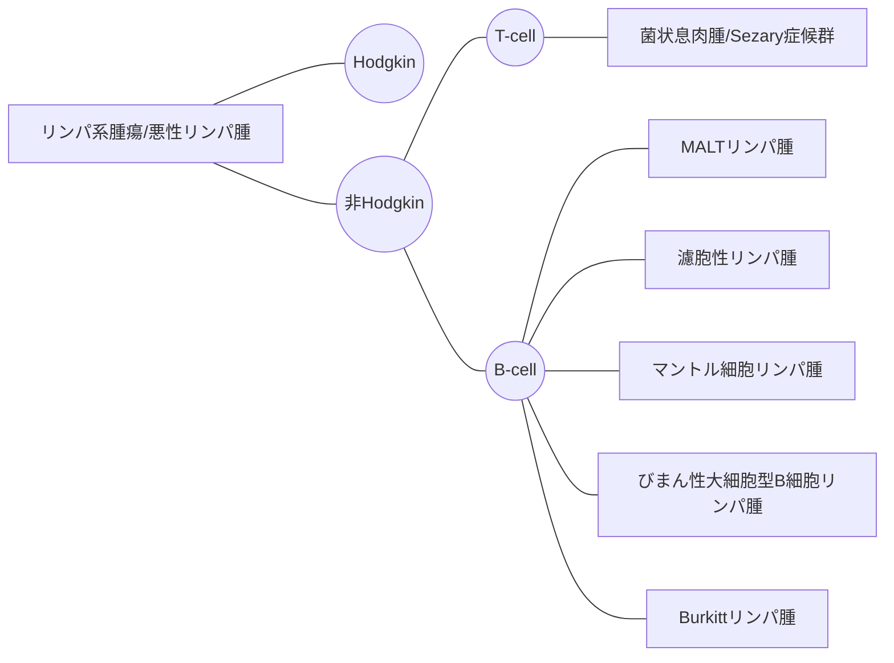

# メモ

白血病は白血球が癌化したものではない。白血球に限らない。赤血球やリンパ球もありうる。

急性の白血病には急性骨髄性白血病と急性リンパ性白血病がある。AMLとALL

リンパ球に異常細胞→白血病かリンパ腫

リツキシマブ、RーCHOP療法は非Hodgkinリンパ腫に対する治療

Hodgkinリンパ腫は多剤併用化学療法

Burkitt > DLBCL > mantle > follicular > MALT

Ann Arbor分類、リンパ腫の広がりで病期を決定する。

悪性リンパ腫　＝　リンパ系腫瘍

良性リンパ腫瘍...リンパ管腫など、亜急性壊死性リンパ節炎(菊池・藤本病)

化学療法の開始にあたって妊孕性障害の可能性を説明することが重要である。

癌のしこりは硬くなりがち

悪性リンパ腫の中で最も頻度が高いのがびまん性大細胞型B細胞リンパ腫(DLBCL)

Hodgikinは連続的な進展を特徴とする

CD3は汎T細胞マーカー

Hodgkinリンパ腫はB細胞由来

ツベルクリン反応陰転化

炎症性サイトカインはフェリチンの産生を活性化する。血球貪食症候群ではサイトカインストームが起きているため血清フェリチンが異常高値をとる。

フェリチンは急性期タンパク質でもある。

肝細胞や骨髄および脾の網内系細胞のマクロファージ中のフェリチンは鉄の供給源となり

総タンパク質 6.5~8.0g/dLが正常。10とかは高すぎる

多発性骨髄腫の第一選択はプロテアソーム阻害薬。ボルテゾミブなど。

多発性骨髄腫の原因細胞は形質細胞。IgGが高くなる。

IgMが高い→原発性マクログロブリン症

